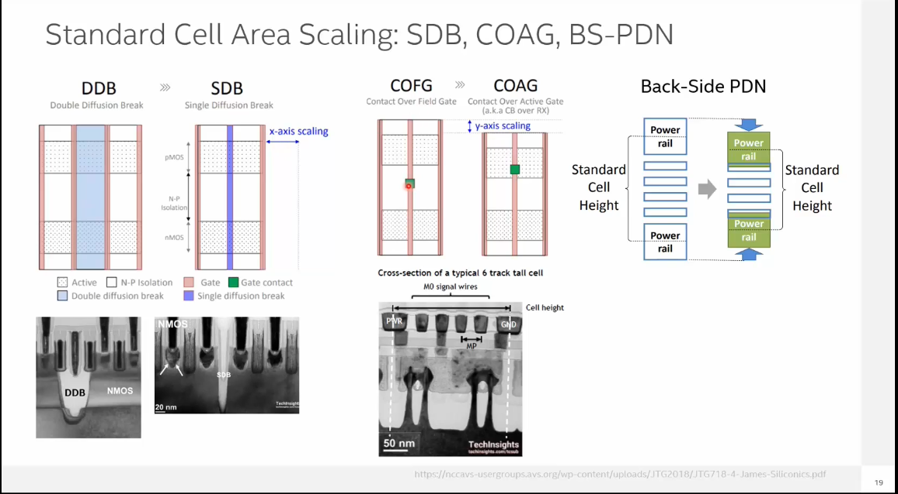
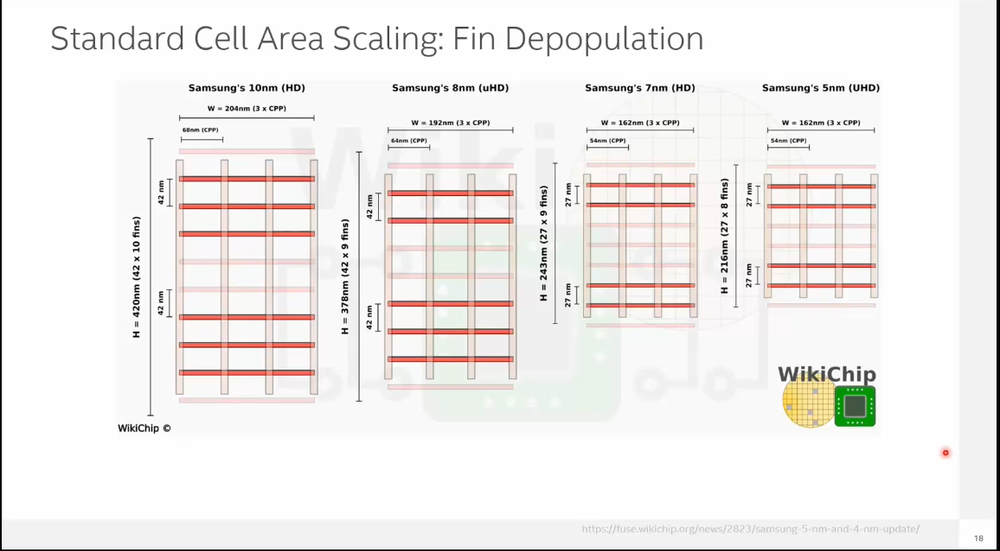

# Scaling Beyond CMOS: FinFET Devices and Innovations

> **Note:** This directory contains infographics and slides generated by NotebookLM, which are helpful for understanding the topic and for future reference.

### CMOS Evolution and Next Gen Candidates

- [The 1nm Roadmap Six Vectors of CMOS](compressed_The_1nm_Roadmap_Six_Vectors_of_CMOS.pdf)

### FINFET Devices 

### CMOS Technology Inflection Points

.png)

### Standard Cell Area Scaling And Variability

.png)

### Parasitics Resistance And Capacitance

.png)

### 3D-Structures

- [TMDs Restore Transistor Control](compressed_TMDs_Restore_Transistor_Control.pdf)

### BOEL Innovations

.png)
- [Power From Below Scaling the Chip](compressed_Power_From_Below_Scaling_the_Chip.pdf)
- [2D Materials 1 Nanometer Transistors](compressed_2D_Materials_1_Nanometer_Transistors.pdf)